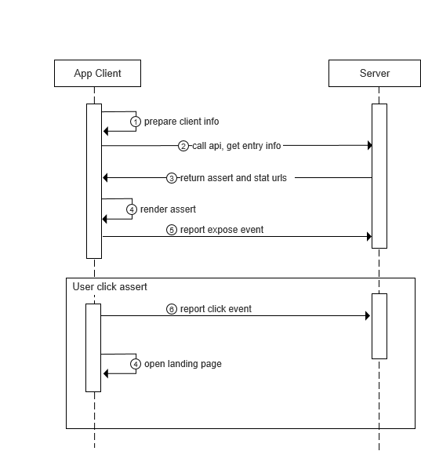

#  Adfly interactive ad api request for comments


## Api overview




### 1. Prepare client info


| Name         | Type   | Description                                          | Required | example                                                                                         |
|--------------|--------|------------------------------------------------------|----------|-------------------------------------------------------------------------------------------------|
| idfa         | string | iOS required                                         | Yes      | 3630C7D4\-EC1F\-4BC1\-820E\-4E2EC9DEDF0D                                                        |
| advertiserId | string | Android required <br/> Get by AdvertisingIdClient\.getAdvertisingIdInfo\(\) | Yes      | d66c3793\-10c1\-48f1\-81bd\-d8f3e6e33d92                                                        |
| longitude    | string | GPS longitude                                        | No       | 118\.78                                                                                         |
| latitude     | string | GPS latitude                                         | No       | 32\.04                                                                                          |
| os           | string | Operate system name and version                      | No       | ios\_11\.3, android\_6\.0\.1                                                                    |
| network      | string | Network type: wifi/3G/4G/2G                          | No       | wifi, 2G, 3G, 4G                                                                                |
| apps         | string | Installed package list\.Package names splited by ‘,’ | No       | com\.ss\.android\. ugc\.live,cn\.v6\.si xrooms,com\.zt game\.bob,com\. nd\.android\.pan dahome2 |

> Apps shouldn’t include system package name, it can be filtered by code:
> ```java
> (app.flags & ApplicationInfo.FLAG_SYSTEM)<=0)
> ```

We get client info, and format it into json. Then compress it by gzip. At last encode it by base64.

```
ci = base64(gzip(json))
```

### 2. Build request

|                | field           | type   | note                           |
|----------------|-----------------|--|--|
| Request param|
|                | appKey          | String |                                |
|                | ci              | String | get by prepare client info     |
|                | timestamp       | Long   | System\.currentTimeMillis\(\)  |
|                | nonce           | String |                                |
|                | deviceId      | String | Andriod： adverserId, iOS: idfs |
|                | signature      | String | signature calc by sha1 |
| Response param | imageUrl        | String | assert url                     |
|                | landingUrl      | String | landing page url               |
|                | reportExposeUrl | String | report expose stat url         |
|                | reportClickUrl  | String | report click stat url          |


#### Generate signature

For api safety, signature is required. We use sha1 calc summary for appKey, appSecret, ci, device_id, nonce, timestmp。And set signature in url query params.

1. Build string as   
    ```appKey={appKey},appSecret={appSecret},ci={ci},deviceId={deviceId},nonce={nonce},timestmp={timestamp}```
2. Use sha1 calc signature

    ```
    signature = sha1.sum(data)
    ```

#### Do request

1. Build request url: 

    ```
    https://api.adfly.vn/api/ig/entry/query?appKey=appkey&ci=urlencode(ci)&deviceId=urlencode(deviceId)&nonce=urlencode(nonce)&timestamp=timestamp&signature=signature
    ```
2. Send http request use any get or post method


**Note:**

1. The appKey and appSecret is generate 
2. At laster url must not contains appSecret


## Examples

- Android Java
- Web Javascript
- iOS Swift

